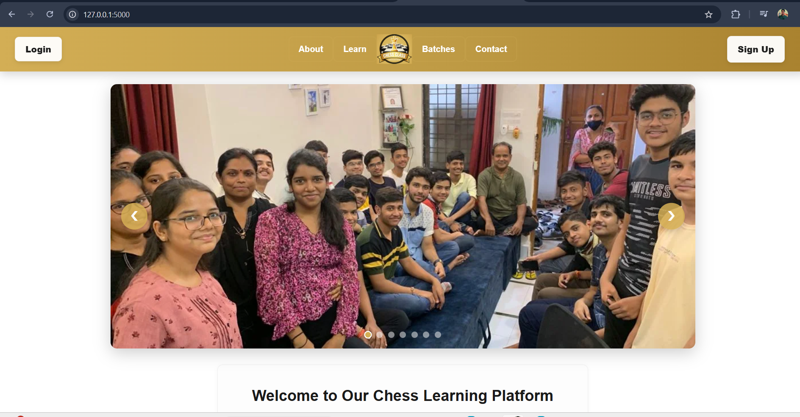
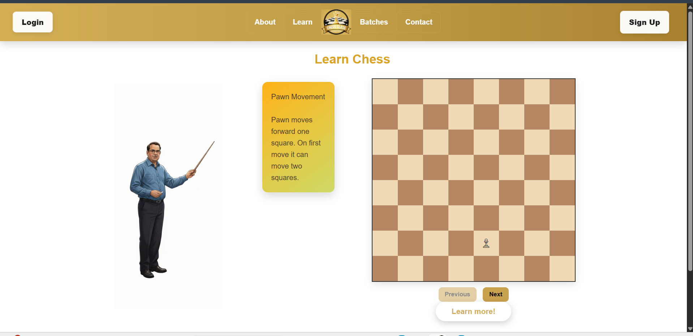

# ♟️ Chess Web Application

A modern **web-based Chess application** built using **Flask**, **HTML/CSS**, **Firebase** and **JavaScript**, designed to be clean, responsive, and easy to extend. This project focuses on separating game logic from UI, making it ideal for learning, customization, and deployment.

**Experience the website:** https://sschessclass.onrender.com/ (changes and suggestions appriciated and welcomed.) 
---

## ✨ Features

* 🎮 Interactive chessboard playable in the browser
* 🧠 Clear separation of backend (Flask) and frontend (JS + templates)
* ⚡ Fast and lightweight Flask server
* 📁 Well-structured project layout
* 🌐 Ready for deployment (Render configuration included)
* 🔐 Environment-based configuration support

---

## 🏗️ Project Structure

```
Chess/
│── app/                # Flask app factory and configuration
│── chess/              # Core chess logic / helpers
│── static/             # CSS, JavaScript, images
│   └── js/
│   └── css/
│── templates/          # Jinja2 HTML templates
│── run.py              # Application entry point
│── requirements.txt    # Python dependencies
│── render.yaml         # Deployment config (Render)
│── .env.example        # Environment variable template
│── README.md           # Project documentation
```

---

## 🚀 Getting Started

### 1️⃣ Clone the Repository

```bash
git clone https://github.com/nikhilsri8052-a11y/chess-web-app.git
cd Chess
```

### 2️⃣ Create & Activate Virtual Environment

```bash
python -m venv venv
venv\Scripts\activate   # Windows
# source venv/bin/activate  # Linux / macOS
```

### 3️⃣ Install Dependencies

```bash
pip install -r requirements.txt
```

### 4️⃣ Configure Environment Variables

```bash
copy .env.example .env   # Windows
# cp .env.example .env   # Linux / macOS
```

Edit `.env` if required.

### 5️⃣ Run the Application

```bash
python run.py
```

Visit 👉 **[http://127.0.0.1:5000/](http://127.0.0.1:5000/)** in your browser.

---

## 🌍 Deployment

This project includes a `render.yaml` file, making it **ready for deployment on Render**.

Steps:

1. Push the project to GitHub
2. Connect your repo on Render
3. Select **Python Web Service**
4. Deploy 🚀

---

## 🧩 Tech Stack

* **Backend:** Python, Flask
* **Frontend:** HTML, CSS, JavaScript
* **Templating:** Jinja2
* **Deployment:** Render

---

## 📸 Screenshots

> 


---

## 🛠️ Future Improvements

* ♜ AI opponent (Minimax / Stockfish integration)
* ⏱️ Chess clock & move history
* 👥 Multiplayer support
* 🎨 Themes and board customization
* ♟️ PGN / FEN import & export

---

## 🤝 Contributing

Contributions are welcome!

1. Fork the repository
2. Create a new branch
3. Commit your changes
4. Open a Pull Request

---

## 👤 Author

**Nikhil Srivastava**
IIT Madras
Passionate about Python, Web Development, Data Science and Problem Solving

---

## ⭐ Support

If you like this project, consider giving it a ⭐ on GitHub — it really helps!

Happy Coding ♟️


